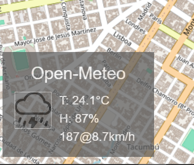

[](https://www.npmjs.com/package/@almamigratoria/leaflet-openmeteo)
[](https://www.npmjs.com/package/@almamigratoria/leaflet-openmeteo)
[](https://github.com/almamigratoria-netizen/Leaflet.OpenMeteo)

# Leaflet.OpenMeteo
A [leaflet](https://leafletjs.com) plugin to display weather using
the [Open-Meteo API](https://www.open-meteo.com).  It was inspired by
the [ Leaflet.Weather ](https://github.com/oskosk/Leaflet.Weather) plugin.  
Primary differences are that Leaflet.OpenMeteo has no dependancies 
(no JQuery), the Open-Meteo api doesn't require an API key (for non-
commerial use), and is for Leaflet version 2. 

[](./screenshot.png)
<br/>
[Live Demo](https://almamigratoria-netizen.github.io/Leaflet.OpenMeteo/)

## Example
``` js
      import { Map, TileLayer, Control} from 'leaflet';
      import {OpenMeteo} from 'OpenMeteo';

      // Create a map in the "map" div, set the view to Berlin
      const map = new Map('mapdiv').setView([52.5, 13.4], 13);

      // add an OpenStreetMap tile layer
      new TileLayer('https://{s}.tile.osm.org/{z}/{x}/{y}.png').addTo(map);

      // add control that displays the weather at the center of the map
      new OpenMeteo({autoTitle: true}).addTo(map);

      // You can add multiple instances.
      new OpenMeteo({
        title: "London",
        center: [51.5, -0.1],
        wind_directions: 'default',
      }).addTo(map);
```

## Installation
Just import the module to your script.  Get it on GitHub, by `npm i @almamigratoria/leaflet-openmeteo` or from your favorite CDN.
```js
    import { OpenMeteo } from 'OpenMeteo';
```

### Options
* `position` - Leaflet [position option](https://leafletjs.com/reference.html#control-position) for Controls.
* `title` - Title for control.  Defaults to "OpenMeteo".  Useful when creating multiple instances.
* `autoTitle` - Looks up a place name using OSM.
* `location` - Not to be confused with `position`, this is the lat/lng from where you want the weather.  Defaults to the center of the map.  Useful when creating multiple instances.
* `wind_directions` - options are:
  * if undefined or omitted, wind direction displayed in degrees
  * an array of strings representing evenly spaced directions (starting at north, rotating clockwise).  You can use this to get directons like "NNE", or things like `["Βορέας", "Εὖρος", "Νότος", "Ζέφυρος"]` if you're an ancient Greek sailor.
  * `default` - (the actual word 'default') uses a pre-defined array `[ "N", "NE", "E", "SE", "S", "SW", "W", "NW" ]`

## License
The Leaflet-OpenMeteo plugin is released under the [MIT License](https://opensource.org/license/mit)<br/>
The [Open-Meteo API](https://open-meteo.com/en/pricing) has a tiered license, which you should check out if you plan on deploying this plugin in a commerical setting.
